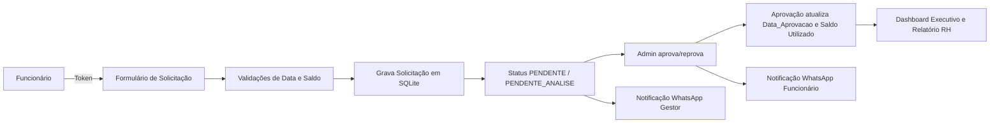

# Arquitetura e Estrutura do Repositório

## Visão Geral do Sistema

Este repositório contém uma solução de gestão de férias baseada em Streamlit e SQLite para suportar o fluxo de solicitação, aprovação, controle de saldo, notificações e relatório para RH.

O componente principal é `admin_app.py`, que atende:
- portal de funcionário com token seguro para enviar solicitação de férias
- painel administrativo para gestão de colaboradores, links, solicitações, dashboard e relatório RH

O módulo `ferias.py` centraliza a configuração da equipe e as regras de limite por cargo.

## Estrutura de arquivos

- `admin_app.py`
  - Aplicação Streamlit principal
  - Implementa o fluxo de aprovação gerencial
  - Gera links de solicitação via token
  - Tem abas para colaboradores, links, solicitações, calendário, dashboard e relatório RH
  - Usa SQLite (`ferias.db`) como persistência

- `ferias.py`
  - Define `EQUIPE` e `LIMITES_EQUIPE`
  - É usado para determinar cargos e regras de conflito de equipe

- `requirements.txt`
  - Lista de dependências Python do projeto

- `DOCUMENTACAO_ARQUITETURA.md`
  - Este documento de arquitetura

- `base_ferias.csv`
  - Arquivo auxiliar presente no repositório, mas o fluxo principal atual usa banco SQLite

## Componentes e responsabilidades

### `admin_app.py`

Responsável pelo comportamento da aplicação e interface do usuário.

Funcionalidades implementadas:
- Inicialização do banco SQLite com tabelas `colaboradores`, `tokens`, `solicitacoes` e `controle_ferias`
- Importação de colaboradores a partir de `ferias_equipe.xlsx`
- Controle de saldo de férias (`saldo_total`, `saldo_utilizado`)
- Formulário de solicitação de férias para funcionários via token
- Validações de regras de data, janela de férias e saldo disponível
- Alerta de conflito de equipe para solicitações com mesmo cargo
- Registro de solicitações com status `PENDENTE` ou `PENDENTE_ANALISE`
- Aba administrativa com:
  - visualização de colaboradores
  - geração de links de token
  - aprovação e reprovação de solicitações
  - botão de notificação via WhatsApp para funcionário aprovadado
- Dashboard executivo com KPIs de colaboradores, pendentes, aprovados e em andamento
- Gráfico de férias aprovadas por mês
- Tabela de carga por equipe
- Relatório RH de solicitações aprovadas com opção de exportar CSV
- Geração de links de WhatsApp via `gerar_link_whatsapp()`
- Estrutura preparada para email via `enviar_email()` sem envio real

### `ferias.py`

Responsável pela definição da equipe e dos limites de férias por cargo.

Esta configuração é usada para:
- identificar o cargo de cada colaborador
- aplicar regras de conflito por cargo
- suportar alertas e decisões de aprovação

### SQLite (`ferias.db`)

Tabelas principais:
- `colaboradores`
  - cadastro de funcionários, telefone, email e cargo
- `tokens`
  - tokens exclusivos para autenticação de solicitação
- `solicitacoes`
  - solicitações de férias com status, data de aprovação e indicador de conflito
- `controle_ferias`
  - controle de saldo total e utilizado por colaborador

## Fluxo de dados

1. `admin_app.py` inicializa o banco com `init_db()`.
2. `importar_equipe()` carrega os colaboradores de `ferias_equipe.xlsx`.
3. `init_controle_ferias()` garante existência do controle de saldo para cada colaborador.
4. Funcionário acessa a aplicação através de link de token gerado em `admin_app.py`.
5. O formulário valida data, janela, saldo e conflito de equipe.
6. A solicitação é salva com status `PENDENTE` ou `PENDENTE_ANALISE`.
7. O administrador aprova ou reprova no painel de `admin_app.py`.
8. Aprovação atualiza `status='APROVADO'`, `data_aprovacao=datetime('now')` e incrementa `saldo_utilizado`.
9. O painel exibe métricas e permite exportar relatório RH de férias aprovadas.

## Diagrama de Fluxo



## Notificações

- WhatsApp
  - `gerar_link_whatsapp(telefone, mensagem)` gera a URL padrão do WhatsApp Web/Known mobile
  - usado para notificar gestor e funcionário
- Email
  - `enviar_email(destino, assunto, mensagem)` retorna payload preparado, pronto para integrar com envio real

## dashboard e relatório

- Aba `Dashboard`
  - KPIs de colaboradores, solicitações pendentes, aprovadas e em andamento
  - gráfico de férias aprovadas por mês
  - carga por equipe
- Aba `Relatório RH`
  - tabelas de férias aprovadas
  - exportação para `ferias_aprovadas.csv`

## Dependências do projeto

- Python 3.x
- streamlit
- pandas
- urllib.parse (biblioteca padrão)

## Como rodar

1. Ative o ambiente virtual
2. Instale dependências
3. Execute o Streamlit:

```powershell
.venv\Scripts\streamlit.exe run admin_app.py
```

## Observações finais

- O sistema atual está pronto para uso corporativo básico sem APIs externas.
- O banco SQLite é local e suporta todo o fluxo de solicitação, aprovação e relatório.
- A documentação destaca o estado atual do projeto e os componentes efetivamente prontos.
